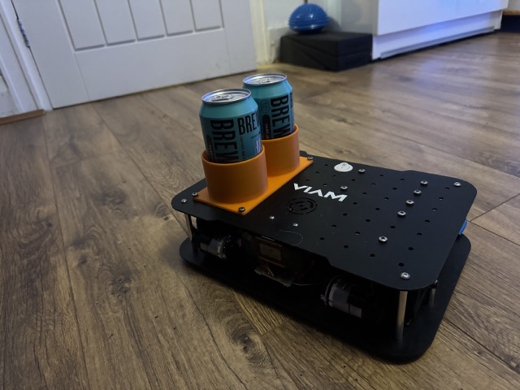
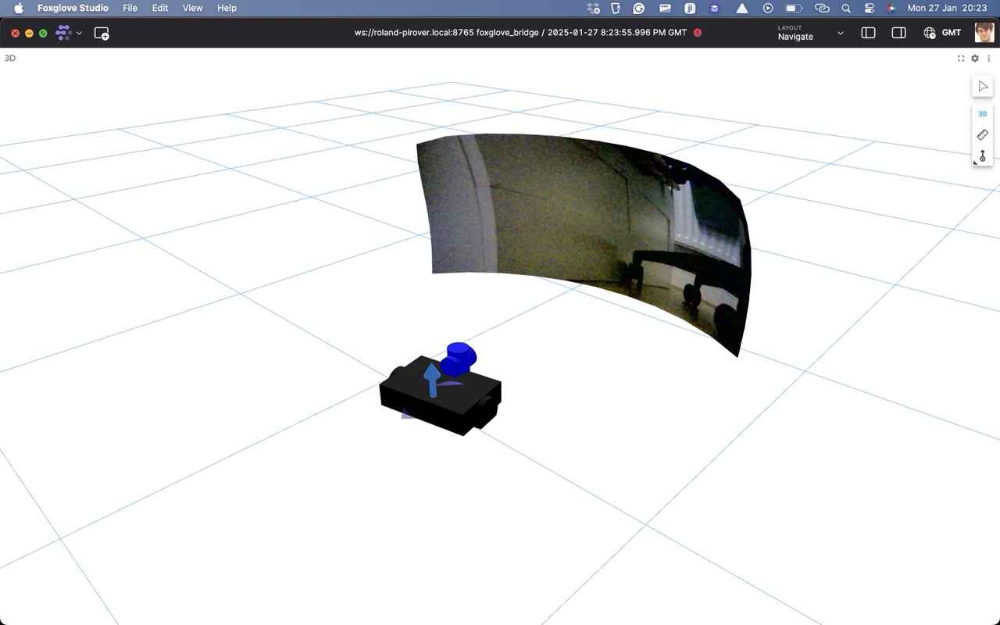

# Viam Rover Ros
This package is a ROS package for the Viam Rover. It completely replaces the Viam software and instead uses ROS to control the rover. I hope that it can provide a cheap entry point into the world of robotics for people who are interested in it as a hobby.



## About the VIAM Rover
The VIAM Rover is a small robot that is designed to be a cheap entry point into the world of robotics. It is based on the Raspberry Pi and uses a motor controller board to control the motors. The rover has a camera sensor, which can be used for remote control. 

You set it up by following the tutorial on the VIAM website. For my robot that was: https://docs.viam.com/dev/reference/try-viam/rover-resources/rover-tutorial-1/. 

## Installation
I personally used ROS2 Jazzy, with Ubuntu Noble (24.04) running on a Raspberry Pi 5. I used the Raspberry Pi imager, which you can download from [here](https://www.raspberrypi.com/software/).

To install the viam rover package you need to clone the repository into your ros2 workspace (for me ~/ros2_ws) and then run: 
```bash
colcon build
ros2 launch src/viam-rover-ros/launch/viam_rover_launch.py
```

## Usage
### Base package
All logic for controlling the robot happens in the `viam_rover_control.py` file. It listens to the `/cmd_vel` topic and then sends the appropriate signals to the GPIO pins to control the motors, and sends odometry data to the `/odom` topic.

### Control the robot
You can control the robot by publishing to the `/cmd_vel` topic. The message type is `geometry_msgs/Twist`. The `linear.x` value controls the speed of the robot and the `angular.z` value controls the turning speed. You can do this by running the following command:
```bash
ros2 run teleop_twist_keyboard teleop_twist_keyboard
```
Alternatively, you can use a game controller plugged into the robot to control it. I created a launch file for the infamous Logitech controller. You can run it by running the following command:
```bash
ros2 launch src/viam-rover-ros/launch/viam_rover_joystick_launch.py
```
You can edit the above launch file to use your own controller by changing the `joy_config` parameter from `xd3` to your controller name. 

### Setting waypoints
As the robot has no way to get distance measurements it does not have 'global localisation' capabilities. However, I hacked together a way to set waypoints relative to the robot. 

You can start my nav stack by running the following command:
```bash
ros2 launch src/viam-rover-ros/launch/viam_rover_local_nav_launch.py params_file:=/home/roland/ros2_ws/src/viam-rover-ros/config/nav2_params.yaml 
```
You can then set a goal by publishing to the `/goal_pose` topic. The message type is `geometry_msgs/PoseStamped`. I personally do this using Foxglove, but you can also do this with RVIZ. Note that in FoxGlove you have to adapt the topic in the 3D view. 

## Visualisation
Common tools for visualisation are RVIZ and FoxGlove. I personally prefer FoxGlove, and I created several configurations I used for the rover. You can find them in the `foxglove_configs` folder.
The configurations I like are: 
- Speed debug (Shows the speed of the robot over time. Allows you to tweak the base package)
- Remote control (Shows the camera feed, and allows you to control the robot commands through Foxglove itself)
- Navigate (Shows the camera feed and the relative position of the robot. Allows you to set waypoints to navigate to). 




## Notes
Initially I wanted to split the control into an odometry node and a motor control node. However, I found that this was not possible as the GPIO pins can only be controlled by one process. Therefore, I combined the two nodes into one. It would still be nice to rewrite the code such that you can only set the motor 'power' through ROS and have another package handle the heavy lifting of calculating the power needed to reach a certain speed.